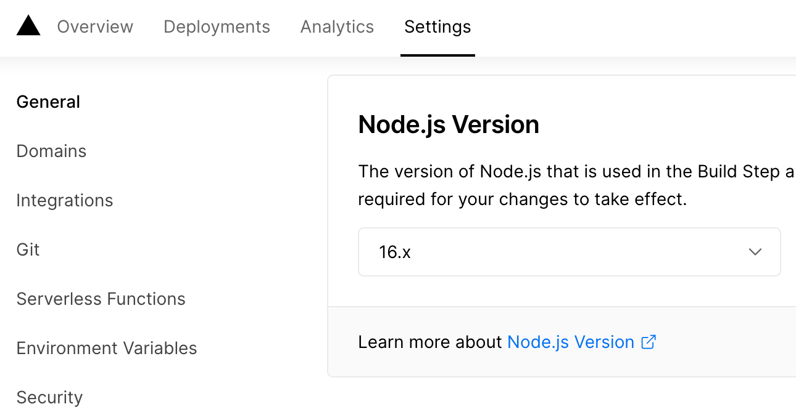

# adapter-vercel

A SvelteKit adapter that creates a Vercel app.

If you're using [adapter-auto](../adapter-auto), you don't need to install this unless you need to specify Vercel-specific options, since it's already included.

## Usage

Add `"@sveltejs/adapter-vercel": "next"` to the `devDependencies` in your `package.json` and run `npm install`.

Then in your `svelte.config.js`:

```js
import vercel from '@sveltejs/adapter-vercel';

export default {
  kit: {
    // default options are shown
    adapter: vercel({
      // if true, will deploy the app using edge functions
      // (https://vercel.com/docs/concepts/functions/edge-functions)
      // rather than serverless functions
      edge: false,

      // an array of dependencies that esbuild should treat
      // as external when bundling functions
      external: [],

      // if true, will split your app into multiple functions
      // instead of creating a single one for the entire app
      split: false
    })
  }
};
```

## Notes

### Vercel functions

Vercel functions contained in the `/api` directory at the project's root will _not_ be included in the deployment — these should be implemented as [server endpoints](https://kit.svelte.dev/docs/routing#server) in your SvelteKit app.

### Node version

Projects created before a certain date will default to using Node 14, while SvelteKit requires Node 16 or later. You can change that in your project settings:



## Changelog

[The Changelog for this package is available on GitHub](https://github.com/sveltejs/kit/blob/master/packages/adapter-vercel/CHANGELOG.md).
